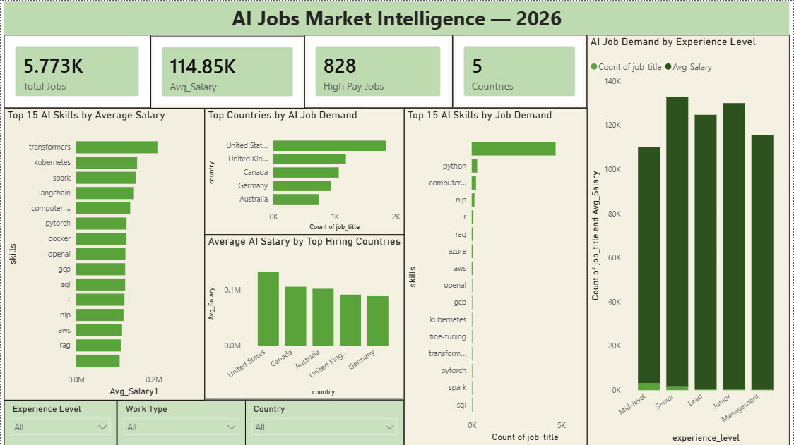

# AI Hiring Market Analysis 2026

Global AI Hiring Market Analysis — Skills, Salaries, Roles, Geography & Predictive Modeling

## Overview

This project analyzes the global AI job market to understand which **skills, roles, experience levels and geographic markets** are associated with higher hiring demand and compensation.

Built as a client-facing **"State of AI Hiring"** analysis for HR and talent teams. Goal wasn't just to report stats — turn job-market data into practical recruitment and compensation recommendations.

Dataset: **AI Job Market Global 2026** — ~5,773 real AI job postings with skills, salaries, locations, experience levels and roles.

---



## Key Findings

- **Geography beats everything.** US alone holds 83% of top-quartile (High band) salaries in the dataset; a single global salary benchmark systematically misprices every market.
- **Skill type matters more than skill count.** Skill count vs. salary correlation ≈ 0.004 — near zero. Specialized skills (Transformers +61%, Computer Vision +19%, LangChain +12% vs. average) carry real premiums; common skills (Python, Azure) don't.
- **Experience level is a weak predictor.** Seniority vs. salary correlation ≈ 0.112 — moving up a tier doesn't reliably mean higher pay in this market.
- **Job attributes alone can't fully predict pay.** A Random Forest regressor on experience/skills/country/title reached R² = 0.38 (MAE ≈ $28K) — most salary variance comes from factors outside these fields.

## Business Problem

AI and data hiring is growing fast, but HR teams face one core question:
> **Which AI skills, roles and markets are actually worth paying a premium for?**

This project investigates:
- Which AI skills are most in demand?
- Which skills are associated with higher salaries?
- Where is AI hiring concentrated geographically?
- How does salary vary across countries?
- How does compensation differ by experience level?
- Does having more listed skills mean higher salary?
- What separates high-paying AI jobs from the rest?
- Can salary be predicted from job posting attributes alone?

---

## Project Objectives

Four stages:

### Part A — Data Understanding & Cleaning
- Load and inspect the job market dataset
- Examine missing values and data types
- Identify salary-related data quality issues
- Calculate average salary from min/max salary
- Normalize the skills data
- Prepare dataset for analysis

### Part B — Skill Premium & Demand Analysis
- Job demand by individual skill
- Average salary associated with skills
- Hiring demand by country
- Salary comparison across major hiring markets
- Demand and compensation by experience level

### Part C — Analytical / Predictive Layer
- Salary correlations (experience level, skill count)
- Salary segmentation into quartile bands (Low / Lower-Mid / Upper-Mid / High)
- Characteristics of higher-paying jobs
- Random Forest salary regression (R² = 0.38, MAE ≈ $28K) — predicts average salary from experience, skill count, remote type, country, job title
- Random Forest high-salary classifier (Accuracy 77%, Precision 93%, Recall 8%) — flags top-quartile jobs; high precision but low recall shows structured fields alone under-detect high earners

### Part D — Client-Facing Report
Findings converted into a short **State of AI Hiring 2026** report with:
- Key market insights
- Salary and skill findings
- Geographic hiring patterns
- HR implications
- A practical compensation recommendation

---

## Dataset

**Dataset:** AI Job Market Global 2026 — ~5,700+ real AI job postings collected from public job APIs.

Key fields:
- Job title, Company, Country, City
- Minimum salary, Maximum salary, Currency
- Remote type, Experience level
- Required skills, Posted date, Source, Job description

Raw dataset not included in this repo due to size — see `notebook/` for the cleaning pipeline.

---

## Tools & Technologies

**Python:** Pandas, NumPy, Matplotlib, scikit-learn (RandomForestRegressor, RandomForestClassifier)

**Business Intelligence:** Microsoft Power BI, DAX, Power Query

**Analysis:** Data cleaning, exploratory data analysis, correlation analysis, salary segmentation, skill demand analysis, geographic analysis, predictive modeling

---

## Data Preparation

Salary converted to estimated midpoint:

```text
Average Salary = (Salary Minimum + Salary Maximum) / 2
